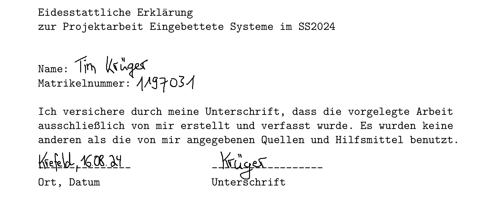
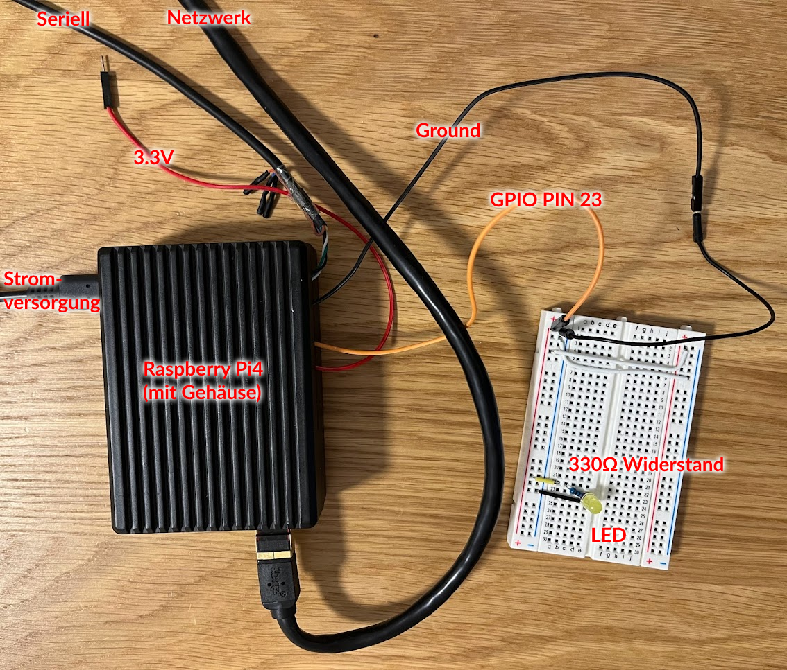
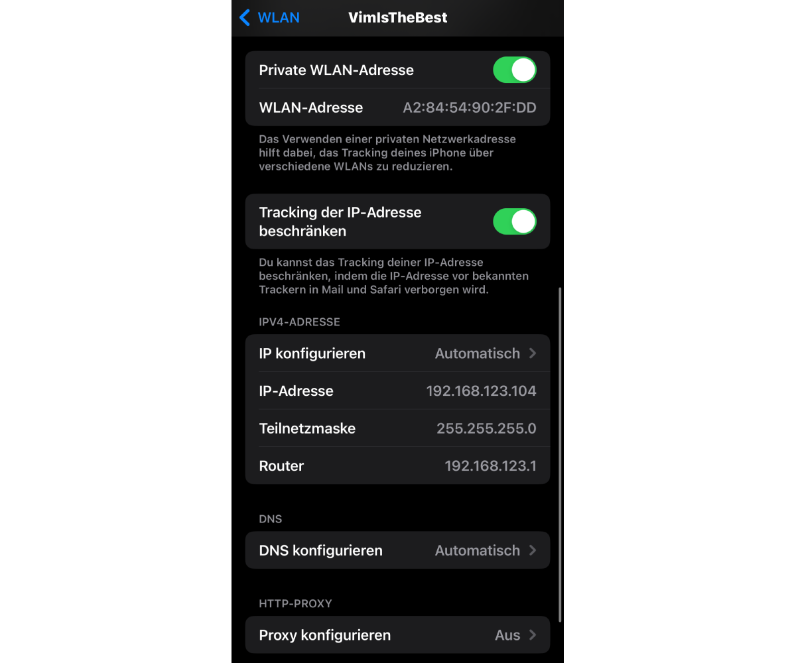
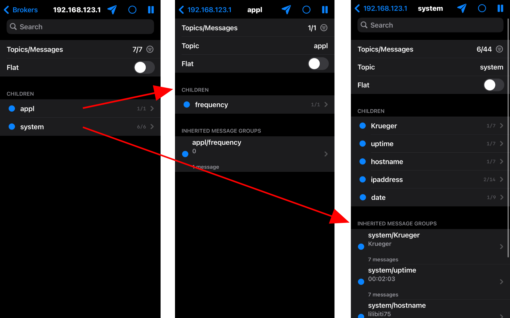

\pagebreak

# Allgemeines

## Persönliche Angaben

Name: Tim Krüger

Matrikelnummer: 1197031

Studiengang: Master Informatik

Datum: 13.08.2024

## Eigenständigkeitserklärung

\pagebreak

# Einleitung

## Motivation

## Aufgabenstellung

\pagebreak

# Installationsanleitung

## Projektstruktur

Als Teil dieses Projekts werden alle notwendigen Dateien (Dokumentation, Configs, Skripte etc.) mitgeliefert. Die Struktur des Dateibaums ist im folgenden dargestellt:

    Dev/ESY/
    |-- buildroot/
    |-- configs/
    |-- devicetree/
    |-- docs/
    |   |-- res/
    |-- kernel/
    |-- modules/
    |-- scripts/
    |-- target/
    `-- txts/

- *Dev/ESY/*: Das Root-Verzeichnis des Projekts
  - Bei einer anderen Verzeichnisstruktur müssen die Skripte *post-build.sh* und *post-image.sh* entsprechend angepasst werden
- *buildroot/*: Das Buildroot-Verzeichnis.
  - Genaue Hinweise folgen in Kapitel 3.3
- *configs/*: Verzeichnis für die Buildroot- und Kernel-Konfigurationsdateien
- *devicetree/*: Verzeichnis für den Device-Tree-Blob zur Ansteuerung der GPIOs
- *docs/*: Dokumentation des Projekts inkl. dem Abbildungsverzeichnis *res/*
- *kernel/*: Verschiedenen Kernelversionen, welche im Laufe des Projekts entstanden sind
  - Genaue Hinweise folgen in Kapitel 3.4
- *modules/*: Der Treiber bzw. das Kernelmodul zur Ansteuerung der LED
  - Genaue Hinweise folgen in Kapitel 3.7
- *scripts/*: Verschiedene Skripte (Teil des Entwicklungsprozesses)
- *target/*: Verschiedenen Skripte und Konfigurationsdateien, welche auf den Raspberry Pi kopiert werden
- *txt/*: Verschiedene Textdateien, hauptsächlich zur initialien TFTP-Konfiguration

## Netzwerkboot

Für einen schnellen Entwicklungsprozess (Iterationsgeschwindigkeit + Deployment) wird Netzwerkboot via TFTP verwendet. Der Raspberry Pi zieht sich hierbei, bei korrekter Konfiguration, alle notwendigen Dateien des Bootprozesses von einem TFTP-Server, welcher auf dem Host-Rechner läuft.

Ein solches Setup kann mit den folgenden Schritten ans Laufen gebracht werden:

- Installation und Starten eines TFTP-Servers auf der Host-Maschine
  - Monitoren des Outputs bspw. via: *tail -f /var/log/syslog | grep tftp*
  - Empfehlung: Extensives Logging aktivieren
- Originale Pi4-Bootfiles herunterladen und ins TFTP-Verzeichnis kopieren
- Bootloader des Raspberry Pi's **muss** für Netzwerkboot angepasst werden
  - Dafür muss der Pi entsprechend geflashed werden
- Anpassung der Netzwerkschnittstellen
  - Zuweisung einer statischen IP ans Ethernet-Interface des Host-PC
  - Zuweisung und Konfiguration des Ethernet-Interface auf dem Pi (erfolgt über die Datei */target/interfaces*)

Es ist außerdem empfehlenswert das serielle Interface des Pi's für Output und Debugging zu verwenden. Die notwendigen Konfigurationsdateien werden bereitgestellt:

- Kopieren der Konfigurationsdateien
  - */txt/cmdline.txt* nach */srv/tftp/*
  - */txt/config.txt* nach */srv/tftp/*
- Installation eines beliebigen Terminalemulators, z.B. *Minicom*
  - Starten bspw. via: *sudo minicom -D /dev/ttyUSB0*

\pagebreak

## Buildroot

## Kernel

## WLAN-AP

## Hardwareaufbau

## Gerätetreiber

## MQTT-Konfiguration

## Anderes

# Systemtest

## Testplan

## Komponententest

### Boot und Entwicklung

### LED-Treiber

### WLAN

\pagebreak

### MQTT

\pagebreak

## Test des Gesamtsystems

# Zusammenfassung
